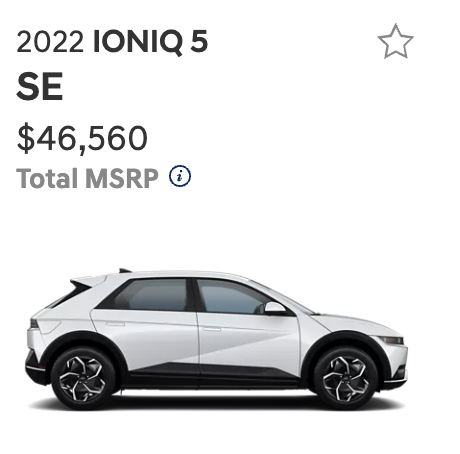
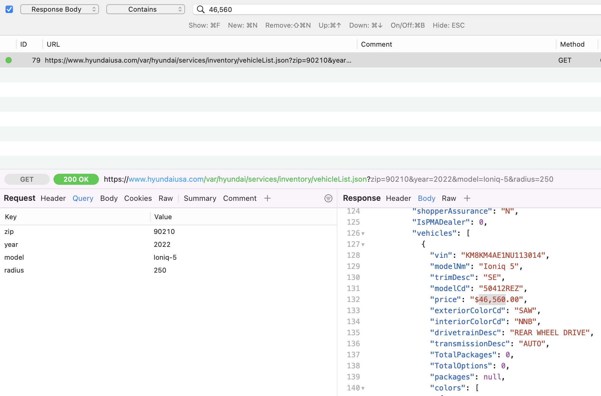

# Adding a New Vehicle to The EV Finder
The EV Finder uses a manufacturer's public inventory API as the source of data for
the site. This means adding a new vehicle to the site likely involves some amount
of web traffic analysis to understand how the manufacturer's API works, and to
produce a JSON object containing inventory data for a user's search parameters.

Thus, the guidance provided here is higher-level and requires a solid
understanding of debugging and troubleshooting HTTP-based traffic, and a general
understanding of REST-based APIs.

## Getting Started
To get started I recommend you invest in obtaining and learning a web debugging
proxy, which aids in dissecting, understanding and debugging web traffic.

A popular and powerful cross-platform choice is [Charles Web Proxy](https://www.charlesproxy.com/), I can also recommend [Proxyman](https://proxyman.io/) for macOS. You _can_ investigate
and debug APIs using the Developer Tools built into browsers like Firefox,
Chrome or Brave but the purpose-built debugging proxies like Charles or Proxyman
provide many advanced features (like editing and re-sending a request, or 
sniffing traffic from a mobile device or mobile device simulator) which is
extremely helpful.

The rest of this guide assumes that you are using a debugging proxy or DevTools
and have them running to capture HTTP traffic.

## Finding and Understanding a Manufacturer’s Inventory API
This is usually as simple as performing a web search for something like 
"\<manufacturer\> inventory search". Follow the search results until you end up on 
a manufacturer's website, which enables you to search for their vehicles given
a zip code and ideally a search radius. Ensure you have a web proxy application
running, or DevTools is open and capturing traffic.

Perform a few inventory searches, adjusting parameters like zip code, vehicle
model and/or search radius. These multiple searches will be extremely helpful
in understanding how the manufacturer's inventory API works.

Once you've captured traffic for a few inventory searches, move over to your proxy
or DevTools and start to analyze the traffic. You'll be looking for request/responses
from the manufacturer's domain. Once you've identified the interesting traffic
I find it helpful to search the response bodies for something unique like a MSRP
or VIN number. This will quickly help to identify the API call which actually
returns the inventory data. 

From here, try to modify the request adjusting things like the zipcode, search
radius or vehicle model to see how the API responds. For some APIs, this is as
simple as editing query parameters for the request URL. For others, you may have
to modify the `POST` data for the API, some APIs are GraphQL-based, requiring you
to better understand their API schema. Expect a lot of analysis, trial and error.

Once you have a solid understanding of how the manufacturer's API works, you
can move on to building the EV Finder API for that manufacturer.

## Building the EV Finder API for a New Manufacturer
Currently, the EV Finder [inventory API](../api/) is a
[Python Flask](https://flask.palletsprojects.com/en/2.2.x/) application which
accepts inventory requests from the EV Finder web app, makes a call to the
requested manufacturer's API and returns the results to the web app.

The EV Finder inventory API was built to allow for future functionality like
saved searches, search / inventory statistics, etc and to be a simple interface
for many disparate manufacturer APIs.

The EV Finder inventory API leverages Flask [Blueprints](https://flask.palletsprojects.com/en/2.2.x/tutorial/views/?highlight=blueprints#create-a-blueprint) to provide clean
separation between various manufacturers. To get started, review the [existing
integrations](../api/src/blueprints) to get a feel for how the code is structured
and some of the helper libraries in use.

The following is a simple checklist for getting the initial scaffolding setup
for a new manufacturer:
1. Create a new blueprint for the manufacturer, with the filename identical to the
manufacturer by copying an existing blueprint.
    - Search and replace within the new manufacturer file, replacing the existing
  manufacturer's name with the new manufacturer's name.
2. Edit [app.py](../api/src/app.py) adding a new `import` and `register` for the
new manufacturer:
    - `from blueprints.manufacturer import manufacturer`
    - `app.register_blueprint(manufacturer)`
3. Now, within your new blueprint file and under the
`@manufacturer.route('/api/inventory/manufacturer', methods=['GET'])`
decorator, you need to write the code which makes an HTTP request to the
manufacturer's API (in whatever form that is), to return a JSON object containing
the inventory results.
    - A simple example is the [Hyundai API](../api/src/blueprints/hyundai.py),
    a slightly more complex example is the [Volkswagen API.](../api/src/blueprints/volkswagen.py)

## Building the EV Finder Web Interface for a New Manufacturer
